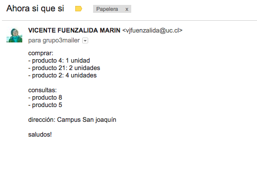
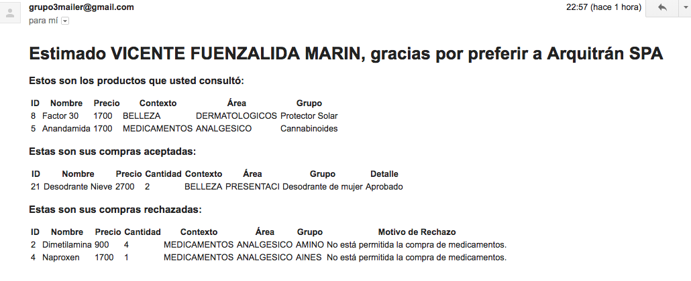

# Email-Bot Channel - Grupo 3 IIC2173

This communication channel allows users to request information about Arquitrán  SpA's drug stores (fictional service).  

Simply send an email with the desired product's IDs, and the application will respond with a detailed email with information provided by Arquitrán via a private server (arqss8.ing.puc.cl).

## Getting Started

These instructions will get you a copy of the project up and running on your local machine for development and testing purposes.

### Prerequisites

1. [Git](https://git-scm.com/book/en/v2/Getting-Started-Installing-Git)
2. [Node.js](https://nodejs.org/en/download/current/)
3. [npm](https://docs.npmjs.com/getting-started/installing-node)
4. [Redis](https://www.digitalocean.com/community/tutorials/how-to-install-and-configure-redis-on-ubuntu-16-04)
5. [MongoDB](https://www.digitalocean.com/community/tutorials/como-instalar-mongodb-en-ubuntu-16-04-es)

### Installing

Clone the repository to your local machine

```
git clone https://github.com/vjfuenzalida/iic2173-grupo3-email
```

Navigate inside the cloned directory

```
cd iic2173-grupo3-email
```

Install the dependencies (npm packages)

```
npm install
```


### Setting Environment Variables

The following list contains the minimum environment variables that must be setted for the app to work correctly:

*  GMAIL_ACCOUNT=*sender account email. Ex: mail@mail.com*
*  GMAIL_PASSWORD=*sender account password. Ex: 123456*
*  REDIS_URL=*Ex: redis://127.0.0.1:6379*
*  NODE_ENV=*Ex: development, testing or production*
*  MONGO_DB=*Database URL. Ex: mongodb://localhost/myapp*
*  MONGO_SECRET=*mongoDB password, if necessary.*
*  SERVER_URL=*API provider. Ex: arqss8.ing.puc.cl*


### Running the Application

Start the node server

```
npm start
```

Or in development mode (w/logs)

```
npm run dev
```

Output should be something like:

```
Node app is running on port 5000
Connected to Redis at: redis://127.0.0.1:6379
Connected to MongoDB
imapConnected
```

## How to Use

To use this service, a token is required, and it is provided to the Email-Bot application once a user is registered at this Web Application page: [arqss10.ing.puc.cl](https://arqss10.ing.puc.cl/).  
After this, the server sends a token to the Email-Bot app, where is stored for future authentication.  

In case you are running this application locally, the application will only be able to listen to emails received by the account setted in GMAIL_ACCOUNT environment variable, but requests to the arqss10.ing.puc.cl server won't be allowed.  

To use the already deployed service, simply send an email to the address  `grupo3mailer@gmail.com`, with the following **body structure**:

**To query products information:**

```
consultar:
- producto X
- producto Y
- producto Z

```

**To buy a certain amount of products:**

```
comprar: 
- producto X: a unidad
- producto Y: b unidades
- producto Z: c unidades

dirección: Av. Mi calle 123
```

where `X, Y and Z` should be product IDs (any amount of spaces are allowed between the colon character and the *producto* or *ID*), `a, b and c` the amounts to order and the field `dirección` the address to delivery.  

Some of the keywords admit modifications, such as:

* comprar/compras/compra
* consultar/consultas/consulta
* unidad/unidades
* dirección/direccion

### IMPORTANT: 

* the keywords *comprar*, *consultar* and *dirección* must be present in order to identify each section.

* It is possible to either buy (*comprar*), query (*consultar*), or both, but the keywords mentioned before must be present to differentiate this actions.

#### For example, this is valid:

```
consultar:
- producto X
- producto Y
- producto Z

comprar: 
- producto X: a unidad
- producto Y: b unidades
- producto Z: c unidades
```


The **subject** isn't restricted to anything, and any other text can be added as details in the **body structure**, for example:

### Example email request



As the example shows, any other text will be ignored by the Email-Bot, so the item list must respect the format imposed.

### Example email response



A common response will contain the result of the purchase transaction if it exists (accepted and rejected products), and the information about the queried products.


## Authors

* [Vicente Fuenzalida](https://github.com/vjfuenzalida)
* [Niv Oksenberg](https://github.com/noksenberg)
